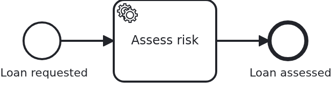

# Versions of a BPMN process

[](./LICENSE)

A process gets changed while workflows are running on the model it had yesterday. Those
workflows keep the version they were started on, and they reach their next task expecting the
behaviour of that version. This blueprint shows how an application serves both without a flag
on the aggregate and without an `if` in the business code.

## What this blueprint shows



One service task, `assessRisk`, and two methods serving it:

```java
@WorkflowTask(taskDefinition = "assessRisk", version = "1")
public void assessRiskManually(final Aggregate loanApproval) { ... }

@WorkflowTask(taskDefinition = "assessRisk", version = ">1")
public void assessRiskAutomatically(final Aggregate loanApproval) { ... }
```

Version 1 of the process had a person assess the risk; every version after it computes a
score. Which method is called is decided by the version of the process definition the
workflow runs on, and that version comes from the BPMS: both Camunda engines count integers
upwards per BPMN process id. A boundary may also be a version tag from the model
(`camunda:versionTag`, `zeebe:versionTag`), and ranges are written `1-3`, `v1.0..v2.0`, `>3`
or `<v2.0`.

The engine of the test is empty, so this model deploys as version 1 and `assessRiskManually`
is what runs. That is the case the feature exists for, seen from the other side: an
application which has moved on, and a workflow which has not.

What is worth knowing beyond the annotation:

- **Two methods may not serve overlapping versions.** VanillaBP reports that while the
  application starts, naming both methods, rather than letting the first task of the wrong
  version find out.
- **The old method is not dead code.** Deleting it while workflows still run on that version
  turns their next task into an incident. VanillaBP says so at startup: it asks the BPMS which
  versions still have running workflows and reports every task definition of such a version
  which no method serves.
- **The old attributes stay on the aggregate.** `assessedBy` is written by no new workflow,
  and removing it would take the data of the running ones with it. The aggregate is the state
  of the business case, not of the current release.
- **A version nobody runs on any more can be declared obsolete** instead of being served
  forever:

  ```yaml
  vanillabp:
    adapters:
      camunda7:
        outfaded-versions: 1
  ```

  This is a statement about workflows, not about deployments: the definition stays in the
  engine, and VanillaBP stops asking for methods serving it.

## Delta to the base blueprint

Compared to [`module-single`](https://github.com/vanillabp-blueprints/module-single-springboot):

|            File            |                                 What is different                                  |
|----------------------------|------------------------------------------------------------------------------------|
| `WorkflowTaskHandler.java` | two methods for one task definition, each with the versions it serves              |
| `Service.java`             | one business method per version of the assessment, neither knowing about the other |
| `model/Aggregate.java`     | `assessedBy` from version 1 next to `riskScore` of the versions after it           |
| `loan_approval.bpmn`       | the task is named `assessRisk`, which is the definition both methods refer to      |
| `LoanApprovalIT.java`      | asserts which of the two methods ran, which is what proves the dispatch            |

## Running it

Requires a JDK 21. Camunda 7 is embedded, so nothing else has to run:

```bash
mvn install verify
```

Running it on another BPMS is a Maven profile, not one line of Java changes:

```bash
mvn install verify -Pcamunda8
```

The test asserts which of the two methods ran, so it needs an engine which does not know
this process yet: the deployment is version 1 there, and version 1 is what the first method
serves. An embedded Camunda 7 starts empty every time. A Camunda 8 cluster does not, so use a
fresh one when you run the test twice.

Camunda 8 is a remote engine, so a cluster has to run. Start one; its address, and everything
else specific to that engine, lives in its profile file
`application/src/main/resources/application-camunda8.yaml`, with a copy for the module's own
test:

```yaml
vanillabp:
  adapters:
    camunda8:
      # Camunda 8 is a remote engine: point this at your cluster.
      rest-address: http://localhost:8080
```

That file is loaded because the Maven profile `camunda8` sets the Spring profile of the same
name, so the engine is chosen once, on the Maven command line, and the build, the tests and
`spring-boot:run` all follow it.

Take the address out and the application does not boot, and says so:

```
Camunda 8 adapter 'camunda8' is used but not configured: the property
'vanillabp.adapters.camunda8.rest-address' is missing.
```

That is the normal way to work with VanillaBP: configuration is validated while booting, and
the message names what to do.

Start the application:

```bash
mvn -pl application spring-boot:run
```

Booting logs a warning per workflow module, and it is meant to be read rather than filtered
away. Both Camunda adapters start out with `name-clash-avoidance: none`, so the identifiers
of this module reach the engine as they are, and the adapter names what it could do instead
and asks for a decision. With one workflow module nothing can collide, which is why this
blueprint leaves the setting alone and keeps its configuration free of `vanillabp.*`. An
application that wants the question answered answers it once:

```yaml
vanillabp:
  adapters:
    camunda7:
      accept-unscoped-identifiers: true
```

That is a promise that the identifiers are unique across all workflow modules, and it turns
the warning into a debug line. Which modes a BPMS offers, and why switching the mode later is
a migration rather than a configuration change, is in
[the wiki](https://github.com/vanillabp/adapter-platform-integration/wiki/Workflow-modules#how-name-clashes-are-avoided).

Start a loan approval. This is the only URL you need:

```
http://localhost:8080/api/loan-approval/start?amount=5000
```

It answers with the ID of the loan request and logs the URL showing the result:

```
Loan approval '0f7c…' started
Credit rating of loan approval '0f7c…' is 50
Show the result -> http://localhost:8080/api/loan-approval/0f7c…
```

Opening that URL shows the aggregate, including the credit rating the service task wrote.

While the application runs on Camunda 7, Camunda's own web applications are served at

```
http://localhost:8080/camunda
```

Log in with `demo` / `demo`. Cockpit shows what the engine is doing with the workflows
started above, which is the view the logged URLs cannot give: where an instance stands, and
why a job failed. The user comes from
`application/src/main/resources/application-camunda7.yaml` and exists so that the
blueprint can be operated without setting one up; an application with an identity provider
of its own leaves that section out.

The Camunda 8 profile brings neither the dependency nor those settings into effect. Its
tooling is part of the cluster, and the file naming a Camunda 7 adapter id is simply not
loaded there - a profile file applies to its own engine and to no other. Naming an adapter
id whose adapter is not on the classpath is a configuration error VanillaBP refuses to
start with, and the profiles are what keeps that from happening.

## How it works

|                                          File                                          |                                          Role                                           |
|----------------------------------------------------------------------------------------|-----------------------------------------------------------------------------------------|
| `loan-approval/src/main/resources/loan-approval/processes/camunda7/loan_approval.bpmn` | the process: one service task, whose definition both methods refer to                   |
| `.../loanapproval/WorkflowTaskHandler.java`                                            | `@WorkflowTask(taskDefinition = "assessRisk", version = ...)` twice, once per range     |
| `.../loanapproval/Service.java`                                                        | `assessRiskManually` for version 1, `assessRiskAutomatically` for the versions after it |
| `.../loanapproval/model/Aggregate.java`                                                | what both of them write, including the attribute only the older version fills           |
| `loan-approval/src/test/.../LoanApprovalIT.java`                                       | starts a workflow and asserts which method served it                                    |

The dispatch happens per delivered task, not per workflow: VanillaBP asks the adapter which
version the workflow runs on and picks the method whose range covers it. A BPMS which does
not report a version serves every method regardless of the annotation, and a range naming a
version tag needs a BPMS which can be asked about its tags.

What this means for a deployment: put the new model and the new method in one release. The
running workflows keep their version and their method, new workflows get the new one, and
nothing has to be migrated. What it costs is an old method per version still in use, which is
the honest price of not migrating running instances.

The reverse is worth stating too. Changing the behaviour of a task without a new version, by
editing the existing method, changes it for the running workflows as well. Sometimes that is
what you want - a bug fix usually is. The version range is for the other case, and the
question to ask is whether a workflow started yesterday should end the way it started or the
way the application works today.

## Documentation

- [Workflow modules](https://github.com/vanillabp/adapter-platform-integration/wiki/Workflow-modules): what a workflow module is, its ID, and where its BPMN files are looked for
- [Defining a workflow module](https://github.com/vanillabp/adapter-platform-integration/wiki/Workflow-modules-in-Spring-Boot#defining-a-workflow-module): the marker file, resource conventions and the module's own configuration files
- [How name clashes are avoided](https://github.com/vanillabp/adapter-platform-integration/wiki/Workflow-modules#how-name-clashes-are-avoided): what the warning at startup is about, and the modes keeping two workflow modules apart
- [Workflow aggregates](https://github.com/vanillabp/adapter-platform-integration/wiki/Workflow-aggregates): why there are no process variables
- [Wire up a process / Wire up a task](https://github.com/vanillabp/spi-for-java#usage): the annotations used in `WorkflowTaskHandler.java`, including the version ranges
- [BPMS adapters](https://github.com/vanillabp/adapter-platform-integration/wiki/BPMS-adapters): which engine reports a version, and which one can be asked about version tags
- the wiki of the [BPMS adapter](https://github.com/vanillabp/adapter-platform-integration/wiki/BPMS-adapters) you use: how a BPMN task has to be modelled for that engine

This blueprint is developed in the monorepo
[`blueprints`](https://github.com/vanillabp-blueprints/blueprints). This repository is a
read-only mirror, **issues and pull requests belong there.**

## Noteworthy & Contributors

[VanillaBP](https://www.github.com/vanillabp/spi-for-java) was developed by [Phactum](https://www.phactum.at) with the
intention of giving back to the community as it has benefited the community in the past.


## License

Copyright 2026 Phactum Softwareentwicklung GmbH

Licensed under the Apache License, Version 2.0
